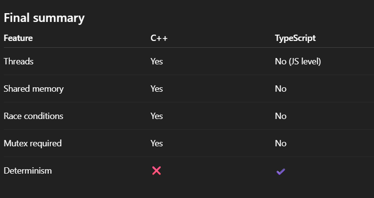

Functional Requirements
1.We can add new coupons at runtime
2.both cart level and product level discounts
3.Support both flat and percentage discounts
4.One coupon can and cannot be applied on top of other coupons
5.Thread safe : JavaScript runs on a SINGLE THREAD so automatically thread safety here

“C++ has shared-memory multithreading, so concurrent threads can mutate the same object simultaneously, which causes race conditions and requires mutexes.
TypeScript (Node.js) runs on a single-threaded event loop where code execution is atomic between awaits, so shared-memory race conditions do not occur, making mutexes unnecessary at the language level.”

